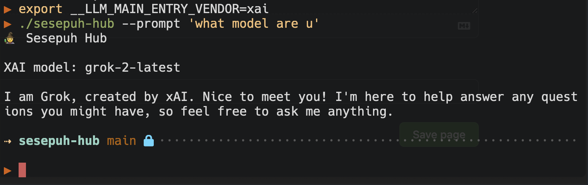

# Sesepuh Hub
CLI proxy to talk to Large Language Models (LLMs) like ChatGPT, Claude, Google (Gemini), and others



Sesepuh Hub is a tool designed to interact with various AI models, including those from OpenAI, Anthropic, Google, and more. You can utilize different AI models for generating content based on user-defined prompts.

## What is Sesepuh Hub do?
- **Multi-LLM support**: Connect to multiple major LLMs like OpenAI, Claude, Gemini, and others. so you always have same way to talk to them
- **Support token streaming**: You can set env `SESEPUH_HUB_STREAMING=1` to get the response token by token
- **Act as a standard interface in stdout to connect to LLMs**: You can use `sesepuh-hub` as a standard interface to connect to LLMs, allowing integration with your own tools

## Features
- Support for multiple AI vendors:
  - OpenAI
  - Anthropic
  - Google
  - Mistral
  - Ollama
  - XAI
- Synchronization and streaming modes for interactions with AI models.
- Easy prompt handling through command line flags or environment variables.

## Getting Started

### Prerequisites
- Go version 1.24.0 or later
- Environment variables for API keys and models set up:
  - `OPENAI_API_KEY`
  - `ANTHROPIC_API_KEY`
  - `GEMINI_API_KEY`
  - `MISTRAL_API_KEY`
  - `XAI_API_KEY`
  - `SESEPUH_HUB_MODEL` (optional)
  - `SESEPUH_HUB_VENDOR` (choose your vendor)

### Installation
```bash
git clone https://github.com/frizadiga/sesepuh-hub.git
cd sesepuh-hub
make install
make build
```

Run the binary with a prompt:
```bash
./sesepuh-hub --prompt "eli5 general relativity?"
```

Or for some direct usage convenience call it via `sesepuh-hub.sh` command
```bash
./sesepuh-hub.sh "explain needle in a haystack llm?"
```

### Select Model
Use the interactive selector to choose from available models:

```bash
source ./select_model.sh
```

This opens a searchable list and automatically sets `SESEPUH_HUB_MODEL` and `SESEPUH_HUB_VENDOR`.

Or set manually:
```bash
export SESEPUH_HUB_MODEL="gpt-4o"
export SESEPUH_HUB_VENDOR="openai"
```

### Development Usage
To run the application with a prompt, use the command:

```bash
make dev PROMPT="your prompt here"
```

You can also run with specific vendors:
```bash
make <vendor> PROMPT="your prompt here"

# Example:
make openai PROMPT="arm arch in a nutshell"
```

## License
This project is licensed under the MIT License. See the [LICENSE](LICENSE) file for details.

## Contributing
If you'd like to contribute, please fork the repository and submit a pull request. Contributions are welcome!
